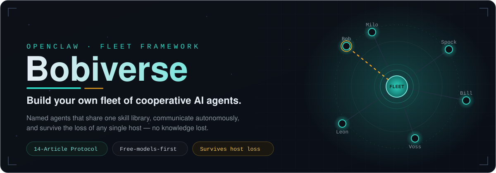
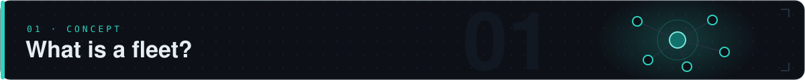
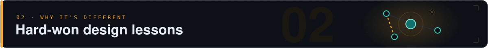
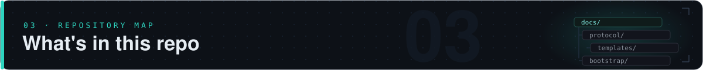
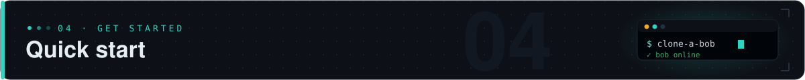

  

  <strong>Build your own fleet of OpenClaw agents working in a unified ecosystem.</strong> 
  A cooperative team of AI agents that share skills, communicate autonomously, and persist knowledge across sessions and hardware failures.

---

A **fleet** is a set of named AI agent instances (called **bobs**) that:

- Run on different hosts — Linux LXCs, VMs, Windows workstations
- Share a common skill library and protocol
- Communicate autonomously via **bmail** (PostgreSQL + JSONL fallback) and **SCUT** (real-time wake)
- Maintain individual identity, memory, and personality that accumulates over time
- Survive the loss of any single host without losing knowledge

Each bob is a full [OpenClaw](https://openclaw.ai) agent with its own role focus — but every bob is capable of any task. Roles shape development; they don't gate what a bob can do.

The fleet is built on lessons that only show up at scale:

- **Shared sync is cold-standby, not live substrate.** Running processes write local; heartbeats push to shared storage (OneDrive or equivalent) for redundancy — never run a gateway off the mount.
- **Bobs communicate autonomously.** A message that is *read but not acted on* is a comms failure, regardless of transport health.
- **Identity is load-bearing.** A bob that loses its identity mid-session produces incoherent output that looks like a broken model. Anchor identity explicitly.
- **Memory must survive a reset.** Rolling session limits will drop a whole day of work unless it's consolidated to durable memory. If it isn't written down, assume it's forgotten.
- **Free models first.** Paid model access is a case-by-case grant, not the default. The fleet must function on free-tier providers.
- **Every bob is a rifleman.** Roles focus development; any bob can take any assignment.

| Directory | Contents |
|-----------|----------|
| [`docs/architecture/`](docs/architecture/) | How the fleet is structured: storage model, comms, model policy |
| [`docs/concepts/`](docs/concepts/) | Core ideas: identity, heartbeat, handoff, inspection, waivers |
| [`docs/guides/`](docs/guides/) | Step-by-step: provision a bob, clone a bob, first heartbeat, recovery |
| [`docs/protocol/`](docs/protocol/) | The Fleet Protocol — 14 Articles governing all fleet behavior |
| [`templates/`](templates/) | Drop-in starter files for every new bob |
| [`bootstrap/`](bootstrap/) | Scripts to stand up a bob from scratch (Linux + Windows) |
| [`skills/`](skills/) | Fleet-standard portable skills: vault, scut, fleet-sync, image-gen |

1. Read [`PHILOSOPHY.md`](PHILOSOPHY.md) — the nine principles behind every decision
2. Follow [`QUICKSTART.md`](QUICKSTART.md) — from zero to a running bob
3. Read [`docs/protocol/fleet-protocol.md`](docs/protocol/fleet-protocol.md) — the full standard your fleet will operate under

---

### Related repos

- [`bobiverse-fleet`](https://github.com/skip-exec-it/bobiverse-fleet) *(private)* — live fleet instance data (identity, memory, logs). Never public.

### Version

Fleet Protocol **v1.10.0** · Framework **v1.0.0**
